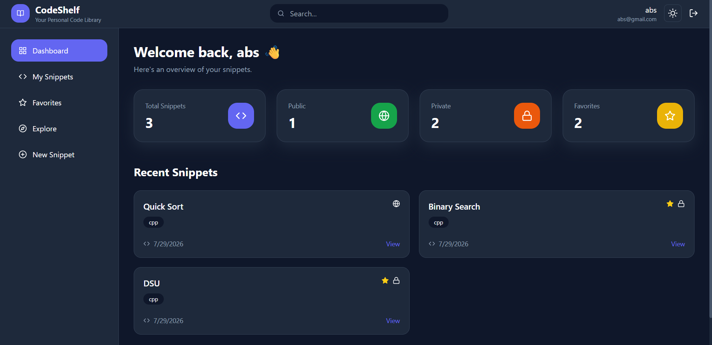
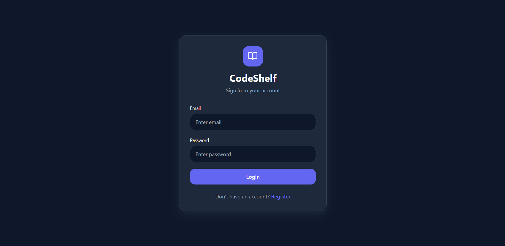
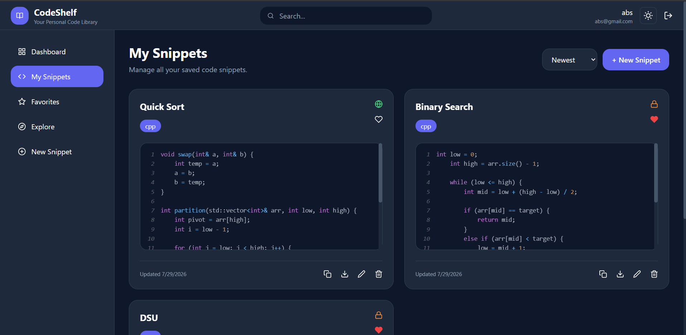
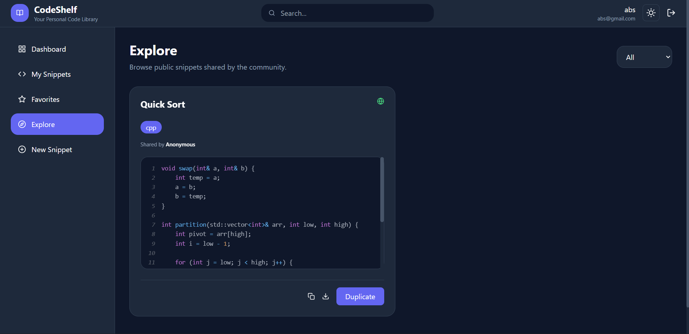

# 🚀 CodeShelf

*A full-stack MERN application for securely storing, organizing, and sharing reusable code snippets.*

---

## 🌐 Live Demo

**Frontend:** https://code-shelf-olive.vercel.app

**Backend API:** https://codeshelf-3ss4.onrender.com

---

# 📸 Screenshots

## Dashboard



---

## Login



---

## My Snippets



---

## Explore Public Snippets



---

# 📖 Overview

CodeShelf is a full-stack MERN application that allows developers to securely save, organize, search, and manage reusable code snippets.

Users can authenticate using JWT, create private or public snippets, organize them using tags, mark favorites, and edit or delete snippets through a responsive interface powered by the Monaco code editor.

The backend follows a layered architecture using Routes, Controllers, Services, Models, and Middleware for clean and scalable code.

---

# ✨ Features

### Authentication

- User Registration
- User Login
- JWT Authentication
- Protected Routes
- Persistent Login

### Snippet Management

- Create Snippet
- Edit Snippet
- Delete Snippet
- Duplicate Snippet
- Favorite / Unfavorite

### Organization

- Public / Private Snippets
- Tags
- Language Support
- Search
- Sorting

### Dashboard

- Total Snippets
- Public Snippets
- Private Snippets
- Favorite Snippets

### User Experience

- Monaco Code Editor
- Syntax Highlighting
- Responsive Design
- Dark / Light Theme
- Toast Notifications

---

# 🛠 Tech Stack

## Frontend

- React 19
- Vite
- Tailwind CSS
- React Router DOM
- Axios
- Monaco Editor
- React Syntax Highlighter
- React Hot Toast
- React Icons

## Backend

- Node.js
- Express.js
- MongoDB Atlas
- Mongoose
- JWT Authentication
- bcryptjs
- dotenv
- CORS

## Deployment

- Vercel
- Render
- MongoDB Atlas

---

# 🏗 Architecture

```
React Frontend
        │
        ▼
Axios
        │
        ▼
Express Server
        │
        ▼
Routes
        │
        ▼
Middleware
        │
        ▼
Controllers
        │
        ▼
Services
        │
        ▼
Models
        │
        ▼
MongoDB Atlas
```

---

# 📂 Project Structure

```
CodeShelf
│
├── backend
│   ├── config
│   ├── controllers
│   ├── middleware
│   ├── models
│   ├── routes
│   ├── services
│   ├── utils
│   └── server.js
│
├── frontend
│   ├── src
│   │   ├── components
│   │   ├── context
│   │   ├── pages
│   │   ├── services
│   │   └── App.jsx
│   └── package.json
│
├── screenshots
│
└── README.md
```

---

# 🔐 Authentication Flow

```
User Login/Register
        │
        ▼
JWT Generated
        │
        ▼
Frontend Stores Token
        │
        ▼
Authorization Header
        │
        ▼
JWT Middleware
        │
        ▼
Protected APIs
```

---

# 📡 REST API

## Authentication

| Method | Endpoint | Description |
|---------|----------|-------------|
| POST | `/api/auth/register` | Register User |
| POST | `/api/auth/login` | Login User |
| GET | `/api/auth/me` | Get Current User |

## Snippets

| Method | Endpoint | Description |
|---------|----------|-------------|
| GET | `/api/snippets` | User Snippets |
| GET | `/api/snippets/public` | Public Snippets |
| POST | `/api/snippets` | Create Snippet |
| PUT | `/api/snippets/:id` | Update Snippet |
| DELETE | `/api/snippets/:id` | Delete Snippet |
| PATCH | `/api/snippets/:id/favorite` | Toggle Favorite |

---

# ⚙️ Installation

## Clone Repository

```bash
git clone https://github.com/tejender25/CodeShelf.git
cd CodeShelf
```

## Backend

```bash
cd backend
npm install
npm run dev
```

## Frontend

```bash
cd frontend
npm install
npm run dev
```

---

# 🔑 Environment Variables

Backend `.env`

```env
PORT=5000

MONGO_URI=your_mongodb_connection_string

JWT_SECRET=your_secret_key

CLIENT_URL=http://localhost:5173
```

---

# 🚀 Future Improvements

- Snippet Collections
- Version History
- Team Collaboration
- AI Code Explanation
- Export / Import Snippets
- Advanced Filters
- Snippet Sharing Links

---

# 👨‍💻 Author

**Tejender Singh**

Built to demonstrate full-stack MERN development, REST API design, JWT authentication, MongoDB integration, and scalable backend architecture.

